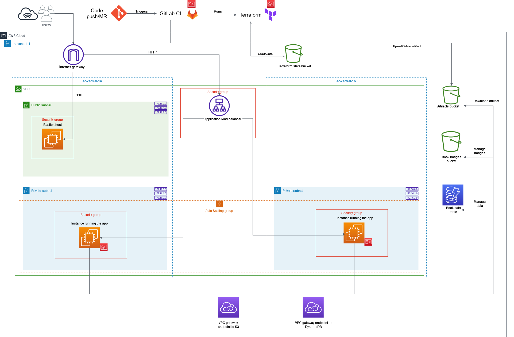
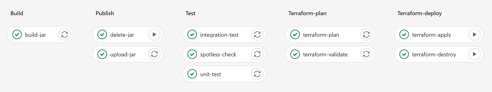

## AWS + Terraform sample application

Simple Book API that uses several AWS components:

 - VPC, subnets, internet gateway, VPC endpoints, route tables.
 - DynamoDB table to store book data.
 - S3 bucket to store book cover images (included bucket policy).
 - EC2 launch template.
 - IAM role and policy for the app with the principle of the least privilege.
 - Application load balancer with public access (forwards to auto-scaling group).
 - Auto-scaling group (using launch template).

All of these resources are provisioned using Terraform, which is applied through the 
GitLab CI/CD pipeline. By default, the resources **are in a destroyed state** because 
it is a waste of money to keep the app running.

See the README-s in the folders for more information:

 - Terraform details: [terraform/README.md](terraform/README.md)
 - Local setup: [local/README.md](local/README.md)

## Application architecture

May contain not yet implemented resources, and some newly added components might be missing.

## CI/CD

Pipeline is defined in the `.gitlab-ci.yml` file.

The following stages are present:

 - Build: Creates fat JAR of the application.
 - Publish: Jobs to upload and delete the JAR to/from the artifacts S3 bucket. 
The EC2 instance will grab it from this bucket later.
 - Test: Run unit, integration and spotless test.
 - Terraform-plan: Validate terraform config and create plan to apply it.
 - Terraform-deploy: Use the plan to create or destroy the infrastructure.

[Example of a passed pipeline](https://git.epam.com/tamas_gaspar2/aws-sample-app/-/pipelines/2641950).

## Possible improvements

A list of improvements that I'm aware of, but had no time yet to implement 
them:

 - ~~Provision load balancer and auto-scaling group instead of just 
plain EC2 instance.~~ ✔
 - ~~Multi AZ deployment support~~ ✔
 - Add caching solution: AWS ElastiCache
 - ~~Use VPC endpoints to reach S3 and DynamoDB instead of connecting
through the public internet.~~ ✔
 - Don't associate public IP address to each EC2 instance. Find way how to be able to SSH 
into instances like that (bastion host?). **Requires point above to be fixed first!**
 - Set up staging environment, only having ``prod`` is not good practice.
 - Configure logging to send logs to some observability platform (find free 
alternative). Right now it is logging to local file and console.
 - ~~Create diagram with application architecture.~~ ✔

