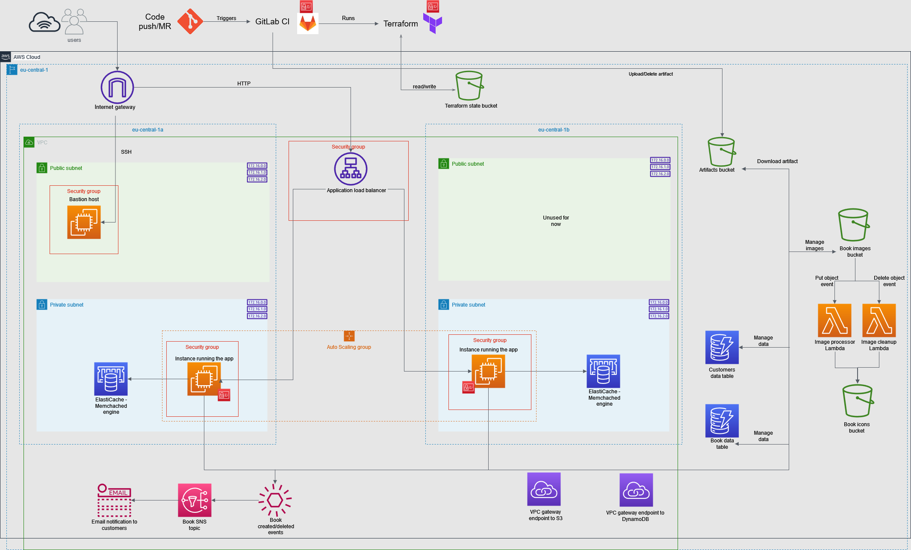

## AWS + Terraform sample application

Simple Book API that uses several AWS components:

 - VPC, subnets, internet gateway, VPC endpoints, route tables.
 - DynamoDB tables to store book data and customers.
 - S3 buckets to store book cover images/icons (included bucket policy).
 - EC2 launch template.
 - IAM role and policy for the app with the principle of the least privilege.
 - Application load balancer with public access (forwards to auto-scaling group).
 - Auto-scaling group (using launch template).
 - ElastiCache cluster (Memcached engine).
 - Lambda function to move images between buckets.
 - SNS notifications to emails

All of these resources are provisioned using Terraform, which is applied through the 
GitLab CI/CD pipeline. By default, the resources **are in a destroyed state** because 
it is a waste of money to keep the app running.

See the README-s in the folders for more information:

 - Terraform details: [terraform/README.md](terraform/README.md)
 - Local setup: [local/README.md](local/README.md)

## Application architecture

May contain not yet implemented resources, and some newly added components might be missing.

Depending on autoscaling group desired capacity and cache cluster 
node count, some private subnets may not have any instances.

## CI/CD

Pipeline is defined in the `.gitlab-ci.yml` file. This project was 
migrated from GitLab, so the CI/CD is defined in GitLab format. I 
have no plans of change to GitHub actions, since that would be time 
consuming and this project is not actively maintained.

The following stages are present:

 - Prereqs: Create "prerequisite" infrastructure that is required for further 
jobs to work. Such as terraform state bucket. This stage is only visible if 
the CI/CD variable `MANAGE_PREREQS` is provided with true value.
 - Build: Creates fat JAR of the application, packages AWS lambda functions.
 - Publish: Jobs to upload and delete the JAR to/from the artifacts S3 bucket. 
The EC2 instance will grab it from this bucket later. Also has jobs to upload AWS 
Lambda deployment packages to S3.
 - Test: Run unit, integration and spotless test.
 - Terraform-plan: Validate terraform config and create plan to apply it.
 - Terraform-deploy: Use the plan to create or destroy the infrastructure.

## Possible improvements

A list of improvements that I'm aware of, but had no time yet to implement 
them:

 - ~~Provision load balancer and auto-scaling group instead of just 
plain EC2 instance.~~ ✔
 - ~~Multi AZ deployment support~~ ✔
 - ~~Add caching solution: AWS ElastiCache~~ ✔
 - ~~Use VPC endpoints to reach S3 and DynamoDB instead of connecting
through the public internet.~~ ✔
 - ~~Don't associate public IP address to each EC2 instance. Create private subnets. Find way how to be able to SSH 
into instances like that (bastion host?).~~ ✔
 - Set up staging environment, only having ``prod`` is not good practice.
 - Configure logging to send logs to some observability platform (find free 
alternative). Right now it is logging to local file and console.
 - ~~Create diagram with application architecture.~~ ✔

